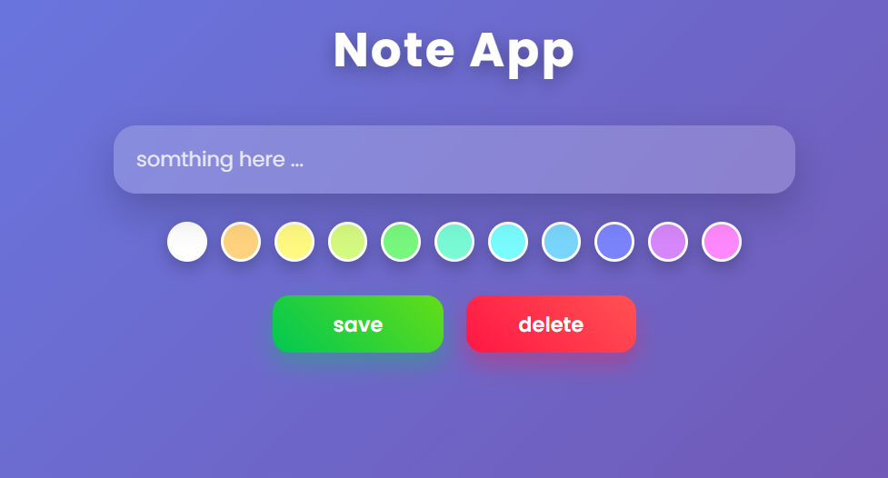

# 📝 Note App

<p align="center">
  
</p>

<p align="center">
  <b>A modern and beautiful Note App built with HTML, CSS & JavaScript.</b>
</p>

---

# 🎥 Live Demo

<p align="center">
  
</p>

### 🌐 Demo Website

👉 https://negarlmd.github.io/Note-App/

---

# ✨ Features

- 📝 Create Notes
- 🎨 Color Picker
- 💾 Save Notes
- 🗑 Delete Selected Note
- 📱 Responsive Design
- 🌈 Glassmorphism UI
- ⚡ Smooth Animations
- 👩‍💻 Personal Developer Footer

---

# 📸 Screenshots

## Home Page


---

## 🛠 Technologies

<div align="center">


</div>

---

# 📂 Folder Structure

```text
Note-App
│
├── index.html
├── README.md
│
├── assets
│   ├── img
│   │      preview.png
│   │      demo.gif
│   │      profile.jpg
│   │
│   ├── stylesheet
│   │      style.css
│   │
│   └── script.js
```

---

# 🚀 Getting Started

Clone the project

```bash
git clone https://github.com/negarlmd/Note-App.git
```

Go to project

```bash
cd Note-App
```

Open

```text
index.html
```

---

# 👩‍💻 Developer

<p align="center">


</p>

## Negar Mohammadi

**Front-End Developer**

Passionate about creating beautiful, responsive and interactive websites.

### Connect with me

🐙 GitHub

https://github.com/negarlmd

💼 LinkedIn

Your LinkedIn URL

📧 Email

your-email@example.com

---

# ⭐ If you like this project

Give it a ⭐ on GitHub.

Made with ❤️ by Negar Mohammadi
